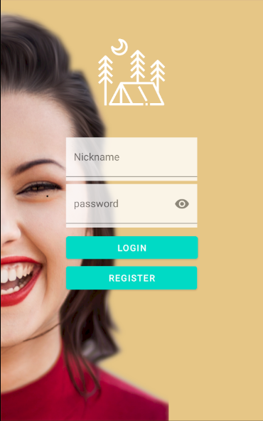
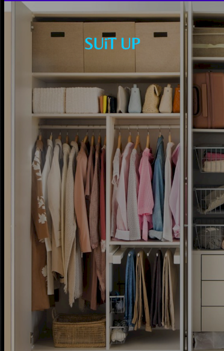
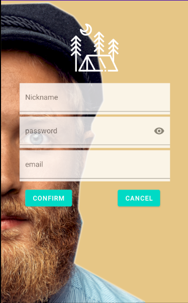

# MyNiceStart
splash | login
-------|-------
 | 
register | MainActivity
 | 

[migpar](https://github.com/migpar)

> Linux is love--"Ernesto Ramiro" :heart:

Es esta actividad llevamos creadas desde el _slpashScreen_ hasta el _MainActivity_

Incluyendo las pantallas de _login_ y _register_